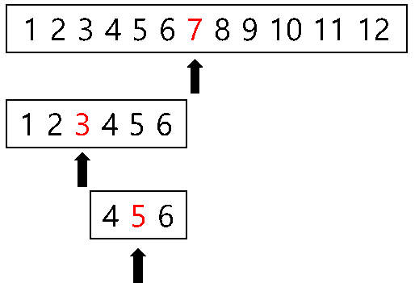

# Search

## Binary Search

*Hackerrank Algorithm Binary Search강의 참고*

#### 정의 및 특징

- Must be sorted (이미 정렬된 상태에서 검색)

- Divide and Conquer 개념을 사용해서 검색 

- 시간 복잡도는 O(logn)

  

  1.   검색할 숫자 정하기 (5)

  2.  배열의 가운데 값(mid)이 5( 검색 숫자) 보다 작으면 배열의 왼쪽 부분에서 검색. 크면 오른쪽 검색

     - 5는 7보다 작으므로 왼쪽 (1 ~ 6에서 검색)
     - 5는 3보다 크므로 오른쪽 ( 4 ~ 6 에서 검색)
     - 5는 mid 값과 일치하므로 종료

     

- Recursive (재귀)를 사용한 Binary Search

  ~~~java
  public static boolean binarySearchRecursive(int[] array, int x , int lenft, int right){
     	if( left > right) {
          return false;
      } 
      
      //int mid = (left + right) /2; // overflow 발생 가능
      int mid = left + ((rigth - left) / 2);
      if( array[mid] == x ){
          return true;
      }else if ( x < array[mid]){
          return binarySearchRecursive(array, x , left , mid -1);
      }else{
          return binarySearchRecursive(array, x , mid + 1 , right);
      }
  }
  public static boolean binarySearchRecursive(int[] array, int x){
  	return binarySearchRecursive(array, x , 0 , array.length -1);
  }
  ~~~

- 반복문을 사용한 Binary Search

  ~~~java
  public static boolean binarySearchIterative(int[] array, int x ){
  
      int left = 0;
      int right = array.length -1;
      
      while( left <= right){
          int mid = left + ((rigth - left) / 2);
          if( array[mid] == x ){
              return true;
          }else if ( x < array[mid]){
              right = mid -1;
          }else{
              left = mid + 1;
          }
      }
      return false;
  }
  ~~~

  

