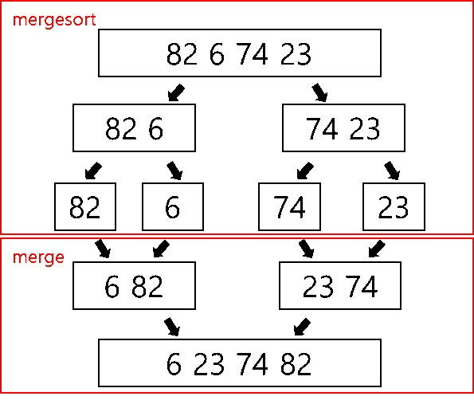

# Sorting

### Contents

- [Bubble Sort](#Bubble%20Sort)
- [Quick Sort](#Quick%20Sort)


## Bubble Sort

*Hackerrank Algorithm Bubble Sort 강의 참고*

#### 정의 및 특징

- 인접한 요소두개가 sorting이 되어있지 않다면 Swap한다. 모든 원소들이 Sorting 될 때 까지 진행한다.

* 시간 복잡도가 O(n^2) 으로 느리다는 단점이 있다. 
* 공간 복잡도는 O(1)로 추가적인 메모리가 필요하지 않다.

~~~java
	// Code from Hackerrank lecture
	public static void bubbleSort(int[] array) {
		boolean isSorted = false;
		int lastUnsorted = array.length - 1;
		while(!isSorted) {
			isSorted = true;
			for( int i = 0 ; i < lastUnsorted ; i++) {
				if( array[i] > array[i + 1]) {
					swap(array, i , i+ 1);
					isSorted = false;
				}
			}
			lastUnsorted--; // Optimization
		}
	}
	
	public static void swap(int[] array , int i , int j ) {
		int tmp = array[i];
		array[i] = array[j];
		array[j] = tmp;
	}
~~~


## Quick Sort

*Hackerrank Algorithm Quick Sort 강의 참고*

#### 정의 및 특징

- pivot element를 사용하여 pivot 보다 작으면 왼쪽으로 크면 오른쪽으로 값을 놓는다. 

- pivot element 는 임의로 선정 하여 사용 ( 배열 첫번째 혹은 중간)

  

  1. pivot을 뽑는다. ( pivot  = 8 )
  2. pivot item보다 작으면 왼쪽으로 크면 오른쪽으로 값을 놓는 작업인 partition 진행
  3. partition을 진행 후 pivot item의 왼쪽 배열을 다시 똑같이 진행한다. (recursive)
     - 왼쪽 부분 배열의 첫번째를 다시 pivot item으로 잡고 partition 진행

#### Time Complexity

- average
  - partition: T(n) = n-1
  - quicksort : O(nlogn) 

- worst-case
  - quicksort: O(n^2)

~~~java
	// Code from Hackerrank lecture
	public static void quicksort(int[] array) {
    	quicksort(array, 0 , array.length -1); // call recursive method
    }
    
    public static void quicksort(int[] array, int left , int right) {
    	if( left >= right)
    		return;
    	
    	int pivot = array[(left + right /2)]; 
    	int index = partition(array, left, right, pivot);
    	quicksort(array, left, index -1);
    	quicksort(array, index, right);
    	
    }
    
    public static int partition(int[] array, int left, int right, int pivot) {
    	while(left <= right) {
    		while(array[left] < pivot ) {
    			left++;
    		}
    		
    		while(array[right] > pivot ) {
    			right--;
    		}
    		
    		if( left <= right) {
    			swap(array, left, right);
    			left++;
    			right--;
    		}
    	}
    	return left;
    }
~~~

더 자세한 코드는 [QuickSort 코드](./Comparator/QuickSort.java) 참고


## Merge Sort

*Hackerrank Algorithm Merge Sort 강의 참고*

#### 정의 및 특징

- 반으로 나눠 sorting을 진행한 후 정렬된 배열을 합친다. 

- Left half sort & right half sort  -> merge left and right 

  

  

  1. merge sort : 배열을 반 쪼개서 길이가 1이 될 때까지 쪼개기 (recursive)
  2.  merge : 두 배열의 값들을 하나씩 비교해서 작은 거부터 넣기 (정렬 , 합치기)

  ```
  mergesort(array){ 
  
      mergesort(arrays' left half)
  
      mergesort(arrays' right half)
  
  	merge left and right half in sorted order
  }
  ```

- 시간 복잡도가 O(nlogn) 으로 빠르다. 

- 공간 복잡도는 O(n)로 추가적인 메모리가 필요하다.

~~~java
	// Code from Hackerrank lecture
	public static void mergesort(int[] array) {
		mergesort(array, new int[array.length], 0 , array.length -1);
	}
	
	public static void mergesort(int[] array , int[] temp , int leftStart , int rightEnd) {
		if( leftStart >= rightEnd) {
			return;
		}
		
		int middle = (leftStart + rightEnd) / 2;
		mergesort(array, temp,leftStart, middle);
		mergesort(array,temp, middle + 1 , rightEnd );
		mergeHalves(array, temp,  leftStart , rightEnd);
	}
	
	public static void mergeHalves(int[] array , int[] temp , int leftStart, int rightEnd) {
		int leftEnd = (rightEnd + leftStart) /2;
		int rightStart = leftEnd + 1;
		
		int size = rightEnd - leftStart + 1;
		
		int left = leftStart;
		int right = rightStart;
		int index = leftStart;
		
		while(left <= leftEnd && right <= rightEnd) {
			if(array[left] <= array[right]) {
				temp[index] = array[left];
				left++;
				
			}else {
				temp[index] = array[right];
				right++;
			}
			
			index++;
		}
        
		System.arraycopy(array, left, temp, index,  leftEnd - left + 1);
		System.arraycopy(array, right, temp, index,  rightEnd - right + 1);
		
		System.arraycopy(temp, leftStart, array, leftStart, size);
		
	}
~~~

더 자세한 코드는 [MergeSort1 코드](./Counting%20Inversions/MergeSort1.java) 와  [MergeSort2 코드](./Counting%20Inversions/MergeSort2.java) 참고

- MergeSort1 은 배열을 인자로 주기때문에 배열을 계속 생성한다.
- MergeSort2는 인덱스 값으로 인자를 주기때문에 배열 계속 생성 하지 않는다. ( 메모리 )

